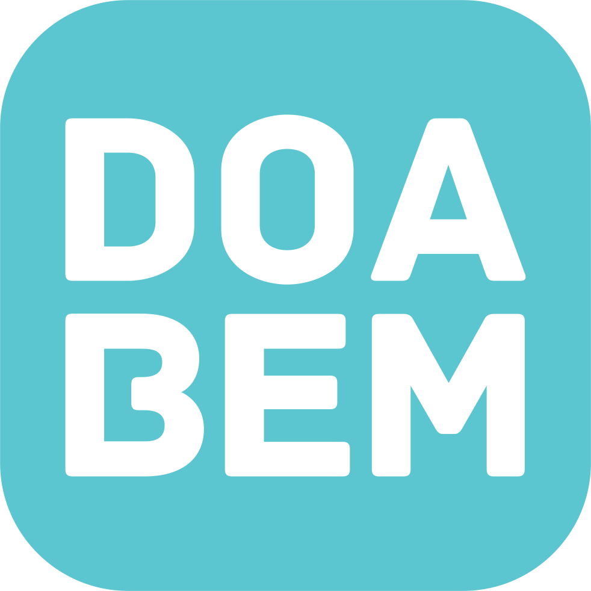

<h1 align="center">
    
</h1>

<h1 align="center">Doa Bem</h1>
<h2 align="center">Encontre alguém e faça o BEM</h2>

## 💻 Sobre o Projeto

 💻🧑‍ DoaBem é uma plataforma para conectar doadores de bens, beneficiários e empresas, onde é possível pesquisar por localização e por casos, possibilitando que o beneficiário valide sua história por vídeo e que todos os usuários compartilhem-na.

Os usuários terão acesso também ao aplicativo móvel, onde poderão ter mais comodidade para ter acesso ao conteúdo a qualquer momento.

Projeto acadêmico desenvolvido no primeiro período dos cursos de Análise e Desenvolvimento de Sistemas e Sistemas para Internet na <a href="https://ficr.catolica.edu.br/portal/">Faculdade Imaculada Conceição do Recife - FICR</a>.

## 🛠 Tecnologias

Foram utilizadas as seguintes tecnologias no projeto:

- Modelagem Conceitual e Lógica: BrModelo
- Mapa Conceitual da Navegação do Sistema: Flowmapp
- Mockup e Protótipo: Figma
- Framework: Materialize e JQuery
- Linguagem de Programação: JavaScript;
- Linguagem de Marcação: HTML5;
- Linguagem de Folhas de Estilo: CSS3;

Antes de começar, você vai precisar ter instalado em sua máquina as seguintes ferramentas:
[Git](https://git-scm.com) e um editor de código como [VSCode](https://code.visualstudio.com/)

### Equipe
---
Feito com ❤️ pela Equipe Áhgil👋🏽 Entre em contato!

<table>
  <tr>
    <td align="center"><a href="https://www.linkedin.com/in/irlaandrade/"> <b>Irla Andrade</b></a> </td>
    <td align="center"><a href="https://www.linkedin.com/in/jpbatista44/"> <b>João Paulo</b></a> </td>
    <td align="center"><a href="https://www.linkedin.com/in/ludmyllavaladares/"> <b>Ludmylla Valadares</b></a> </td>
    <td align="center"><a href="https://www.linkedin.com/in/samuel-nunes-057899133/"> <b>Samuel Nunes</b></a> </td>
  </tr>
</table>